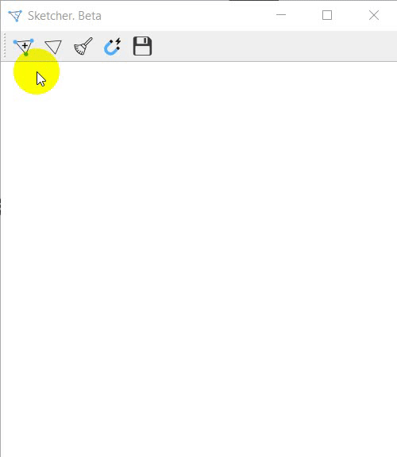

# SimpleSketcher
Графический редактор позволяет быстро рисовать и размечать наброски от руки. 

Как пользоваться:
1. Рисуем набросок
2. Когда дорисовали, нажимаем на первую кнопку Add KeyPoints и кликаем там, где должны быть ключевые точки. 
2.1 Точки должны наноситься последовательно, то есть в определенном порядке.  
2.2 Чтобы точка оказалась именно там, где нужно, необходимо прицелиться туда, где она должна быть, но при этом специально немного сдвинуть курсор в сторону так, чтобы ближайшей точкой к этому месту оказалась та точка, которая должна быть отмечена. 
3. Нажать на кнопку Magnet (Магнит), чтобы скорректировать точки.
4. Нажать на предпоследнюю кнопку Save (Сохранить), чтобы сохранить рисунок и координаты точек.
5. Для нового наброска нужно нажать на кнопку Clear All (Очистить все) и затем нажать на вторую кнопку Add Sketch, которая позволит рисовать.
6. Повторить пункты 2-4.

Ctrl+Z - Отменить действие (до 3-х раз); 
Ctrl + Shift + Z - Повторить действие (до 3-х раз);

Рисунки сохраняются в папку out 

Дополнение: Чтобы проверить, как работает программа, нужно нажать на последнюю иконку с глазом (Check). Затем перейти в папку out/test/, где будут лежать изображения с отмеченными точками.
